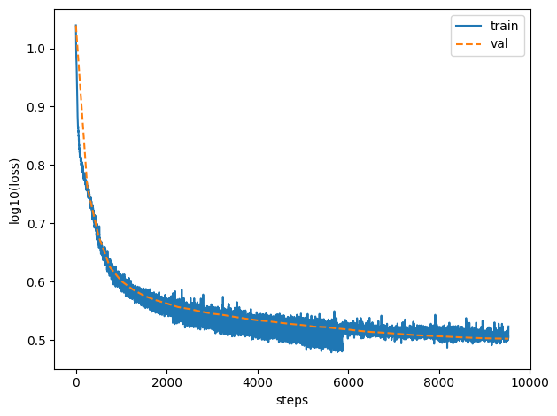

# GPT-2 Pretraining

A from-scratch GPT2 implementation pretrained on a 5 billion token subset of the FineWeb-Edu dataset's 10B subset, Modeled after Karpathy's [nanoGPT](https://github.com/karpathy/nanoGPT). Achieves 28.65% accuracy on HellaSwag validation, coming within 0.3% of the original GPT-2 small's 28.92% accuracy despite training on just half the data. (GPT2 was trained on WebText ~10Bn tokens). This I assume is because of different dataset quality.

## HellaSwag Benchmark

| Model               | Accuracy | Multiple Choice Accuracy | Training Tokens | Dataset          |
|---------------------|----------|---------------------|-----------------|------------------|
| GPT-2 small (124M)  | 28.92%   | 31.14%              | ~10B           | WebText          |
| [mine](https://drive.google.com/file/d/1FT_xcA26tvcNaEiQfjIsifknF2wR9SqB/view?usp=sharing)                | 28.65%   | 29.55%              | 5B              | FineWeb-Edu (subset\*) |

\*5Bn subset of Fineweb-Edu's Sample 10Bn dataset

## Loss




## Sample Output

```
Input: Hello, I'm a language model,
> Hello, I'm a language model, you're asking me if I want a simple way to explain what a simple language will do but you're wondering
> Hello, I'm a language model, so what I'd like to do is to change the parameters and let me try it for my future job.
> Hello, I'm a language model, so I know that when you don't know where to start, I can think of no one. When I
> Hello, I'm a language model, so if you get lost in a language, try to learn English. I used to say English is a language
> Hello, I'm a language model, so here we go here:
I think that there is a need for a language-centered framework that addresses
```

## Files
- `model.py`: Minimal GPT2 implementation
- `train.py`: Training script with multi-gpu training support
- `utils.py`: Mainly contains data loader.
- `download-fineweb-edu.py`: Downloads the FineWeb Edu (10Bn) dataset from Hugging Face, tokenizes it, and saves it in shards.

## Training

1. Download dataset
```
python download-fineweb-edu.py
```

2. Start training:

```
./train.sh
```

- This script automatically detects available GPUs and uses DDP for multi-GPU training
